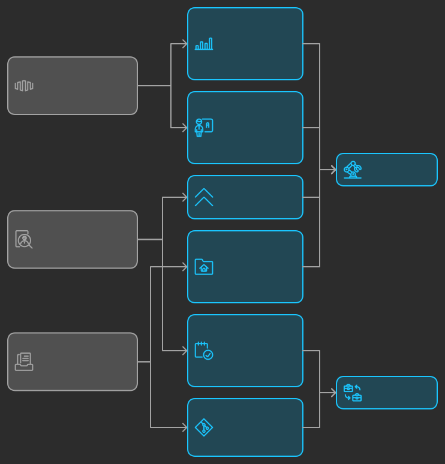
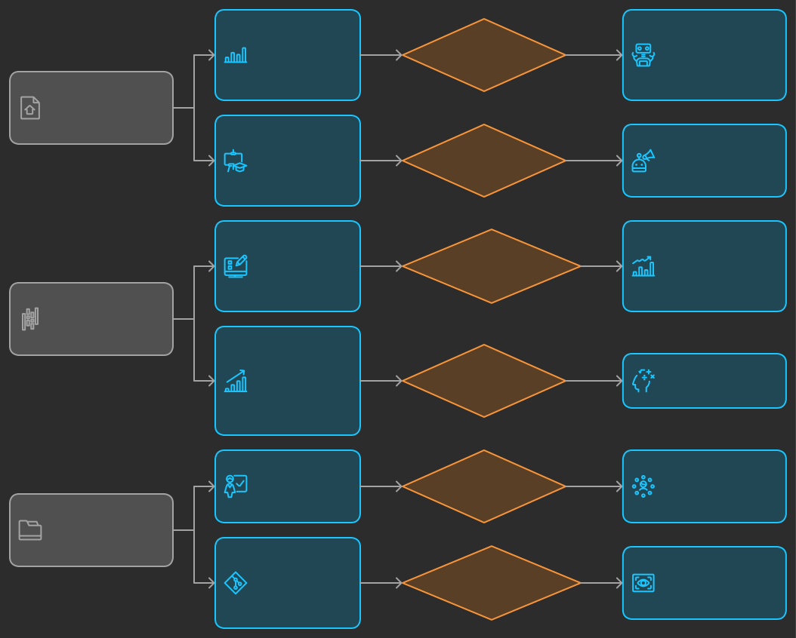

# Consideraciones de diseño del curso 

## Consideraciones iniciales

Estas consideraciones iniciales salen de las reuniones iniciales con el grupo 
de profesores que dirigen los programas de la Escuela de Administración, 
Economía y Negocios:

* El curso tendrá una duración de 50 horas.
* El curso se compone de 4 sesiones presenciales, cada una de 4 horas, y 
  34 horas de trabajo independiente. 
* Se acerca la renovación del registro calificado de algunos programas. 
  También, posibles transformaciones curriculares.
* Se ve necesario articular el currículo con los avances tecnológicos.
* Se reconoce una brecha entre el currículo y lo que realmente ocurre en las 
  empresas.
* Se identifica la necesidad de actualizar a los profesores en el uso 
  de herramientas y procesos que están alineados con el día a día de las 
  empresas.
* Se considera necesario introducir herramientas basadas en inteligencia 
  artificial en los cursos.
* Se considera que el diseño y implementación de este curso será exitoso 
  si sirve de insumo para el diseño de experiencias de aprendizaje en 
  los cursos de los programas.
* Se busca que el curso permita a los asistentes acercarse a los fundamentos 
  que permitan seleccionar de manera informada herramientas.
* Se desea incorporar en los cursos herramientas que soporten el análisis de 
  datos y la toma de decisiones.

## Objetivos del curso 

Proponemos tres objetivos fundamentales para el curso:

1. Objetivo del curso: desarrollar la capacidad de diseñar, implementar y evaluar    
   experiencias de aprendizaje contextualizadas, que integren herramientas de inteligencia artificial, para abordar problemas de análisis de datos, automatización de procesos, la toma de decisiones y/o las necesidades que determine el profesor en su curso. 

2. Objetivo de análisis crítico de pertinencia: fomentar en los profesores la capacidad de analizar 
   críticamente si las experiencias de aprendizaje que diseñan ofrecen a los estudiantes oportunidades para desarrollar competencias relevantes y alineadas con la realidad y las tendencias actuales del mundo de los negocios, asegurando que el aprendizaje sea significativo y actualizado.

3. Objetivo de sistematización: sistematizar las experiencias de aprendizaje creadas por los 
   profesores en un repositorio estructurado, con el propósito de compartir prácticas y recursos innovadores que enriquezcan la comunidad educativa.

## Competencias, criterios y niveles esperados

### Competencia de diseño e implementación

Competencia: diseña, implementa y evalúa experiencias de aprendizaje contextualizadas que integren herramientas de inteligencia artificial para abordar problemas de análisis de datos, automatización de procesos, la toma de 
decisiones y/o las necesidades específicas del curso.

Criterios de competencia:

Analizo problemas de análisis de datos, automatización y toma de decisiones en el contexto de un curso, proponiendo soluciones basadas en IA. (Nivel: autónomo)

Diseño experiencias de aprendizaje que integran herramientas de IA, asegurando que sean significativas y aplicables al contexto del curso (Nivel: autónomo).

### Competencia de análisis crítico

Competencia: analiza críticamente las experiencias de aprendizaje diseñadas, asegurando que ofrezcan oportunidades relevantes y alineadas con las tendencias actuales del mundo de los negocios, para un aprendizaje significativo y actualizado.

Criterios de Competencia:

Analizo las experiencias de aprendizaje para determinar su relevancia y alineación con las tendencias del entorno empresarial, aplicando estrategias avanzadas de evaluación (Nivel: estratégico).

Propongo mejoras basadas en un análisis crítico, asegurando que las experiencias sean actualizadas y significativas (Nivel: autónomo).

### Competencia de Sistematización

Competencia: sistematiza las experiencias de aprendizaje creadas en un repositorio estructurado, facilitando el intercambio de prácticas y recursos innovadores con la comunidad educativa.

Criterios de Competencia:

Sistematizo mis experiencias educativas, organizando los recursos y materiales de manera coherente y estructurada (Nivel: autónomo).

Desarrollo un repositorio que sea accesible y útil para otros educadores, asegurando la calidad y claridad de la información compartida (Nivel: estratégico).

## Análisis de los niveles de los criterios propuestos

### Competencia de diseño e implementación

Criterio: analizo problemas de análisis de datos, automatización y toma de decisiones en el contexto de un curso, proponiendo soluciones basadas en IA. (Nivel: autónomo)

Razonamiento: se elige el nivel autónomo porque se espera que los profesores no solo comprendan los problemas, sino que sean capaces de analizar y proponer soluciones de forma independiente y con criterio propio. Evaluar este criterio a un nivel resolutivo sería insuficiente, ya que solo implicaría aplicar soluciones estándar sin un análisis profundo. En cambio, un nivel estratégico podría ser demasiado exigente, dado el tiempo limitado y la necesidad de mostrar innovación y planificación avanzada.

Criterio: diseño experiencias de aprendizaje que integran de manera efectiva herramientas de IA, asegurando que sean significativas y aplicables al contexto del curso. (Nivel: autónomo)

Razonamiento: este nivel implica que el profesor puede diseñar de manera independiente, asegurando que las experiencias se adapten a las necesidades de su contexto específico. Se elige un nivel autónomo porque se espera que los profesores desarrollen un diseño sólido y justificado. Un nivel resolutivo sería demasiado básico, mientras que un nivel estratégico podría requerir una planificación más avanzada e innovación que quizás no sea factible dentro del marco del curso.

### Competencia de Análisis Crítico

Criterio: analizo las experiencias de aprendizaje para determinar su relevancia y alineación con las tendencias del entorno empresarial. (Nivel: estratégico)

Razonamiento: se elige un nivel estratégico porque este criterio implica un análisis profundo y la capacidad de aplicar estrategias de evaluación en contextos complejos. Aquí, el profesor debe demostrar no solo un entendimiento crítico, sino también la capacidad de evaluar cómo las experiencias se alinean con tendencias emergentes. Un nivel autónomo sería insuficiente para captar la complejidad de este análisis.

Criterio: propongo mejoras basadas en un análisis crítico, asegurando que las experiencias sean actualizadas y significativas. (Nivel: autónomo)

Razonamiento: se elige un nivel autónomo porque se espera que los profesores puedan sugerir mejoras de manera independiente y fundamentada, pero sin la necesidad de desarrollar estrategias avanzadas o completamente innovadoras, como lo requeriría un nivel estratégico. Un nivel resolutivo no sería adecuado, ya que solo implicaría hacer cambios sencillos sin una justificación crítica.

### Competencia de Sistematización

Criterio: Sistematizo mis experiencias educativas, organizando los recursos y materiales de manera coherente y estructurada. (Nivel: autónomo)

Razonamiento: se elige un nivel autónomo porque los profesores deben ser capaces de organizar y sistematizar su trabajo de forma independiente y coherente. Este nivel es apropiado para el desarrollo de un repositorio que sea útil y accesible. Un nivel resolutivo sería demasiado básico y no captaría la complejidad de organizar materiales de manera efectiva, mientras que un nivel estratégico podría requerir elementos avanzados de planificación y diseño que no sean factibles en el marco del curso.

Criterio: desarrollo un repositorio que sea accesible y útil para otros educadores, asegurando la calidad y claridad de la información compartida. (Nivel: estratégico)

Razonamiento: este criterio requiere un nivel estratégico porque implica crear un recurso que no solo cumpla con estándares básicos, sino que también sea innovador y altamente funcional para la comunidad educativa. Aquí, se necesita una planificación avanzada para garantizar que el repositorio sea efectivo. Un nivel autónomo no captaría la necesidad de asegurar calidad y accesibilidad a un nivel elevado.

## Evidencias de aprendizaje

El curso se estructurará utilizando micro challenges (personalizados a cada profesor), alineados 
con las tres fases del marco Challenge Based Learning (CBL): Engagement (Compromiso), Investigation (Investigación) y Action (Acción). Cada fase incluirá actividades específicas para asegurar que los profesores logren los objetivos del curso.

Se esperan estos productos durante el curso:

1. Planteamiento del desafío: una definición clara y justificada del desafío que abordará cada 
   profesor durante el curso. Es de aclarar que esto se refiere al curso para preparar la 
   experiencia, no a la experiencia misma, es decir, el profesor podría diseñar la experiencia 
   como un RETO o definir otra estrategia.

2. Diseño de la experiencia de aprendizaje: un esquema detallado de la experiencia, con actividades 
   clave y recursos pedagógicos alineados con las competencias identificadas.

3. Material didáctico completo: todos los recursos y materiales necesarios para implementar la 
   experiencia en el curso.

4. Métricas de éxito: un conjunto de criterios y herramientas de evaluación para medir el éxito de la 
   experiencia de aprendizaje.

5. Plan de recolección de evidencias: un plan detallado para recopilar evidencias necesarias para 
   evaluar el éxito de la experiencia.

6. Documentación sistematizada: la experiencia de aprendizaje completamente documentada y preparada 
   para su inclusión en el repositorio comunitario.

## Estructura

### Engage (Comprometerse)

Propósito: motivar (aunque esto es un compromiso compartido) a los profesores y ayudarlos a identificar un desafío educativo significativo y contextualizado, relacionado con el desarrollo de competencias utilizando herramientas como la inteligencia artificial y la automatización. Esta fase busca que los profesores reflexionen sobre las necesidades de sus estudiantes y el contexto de sus cursos, y formulen un desafío claro que puedan abordar. Se busca conectar el desafío con las tendencias actuales del mundo empresarial y educativo para asegurar su relevancia.

Actividades y evidencias: sesión 1.

### Investigate (Indagar)

Propósito: facilitar un proceso de investigación donde los profesores profundicen en el desafío identificado, explorando tanto teorías educativas como tecnologías disponibles. En esta fase, los profesores recopilan información, investigan soluciones existentes, analizan casos de estudio y reflexionan sobre las mejores prácticas. El objetivo es que comprendan el problema en profundidad y generen ideas informadas para el diseño de una solución. Esto incluye analizar cómo la inteligencia artificial y la automatización pueden integrarse en experiencias de aprendizaje efectivas.

Actividades y evidencias: sesiones 2 y 3.

### Act (Actuar)

Propósito: diseñar una experiencia de aprendizaje completa que integre las herramientas y conceptos investigados. En esta fase, los profesores desarrollan la planeación detallada, el material didáctico, las métricas de evaluación y el plan de recolección de evidencias. Aunque la implementación real se pospondrá para el semestre siguiente, el diseño debe ser lo suficientemente robusto y detallado para que pueda llevarse a cabo y evaluarse de manera efectiva. Se proporciona espacio para asegurar que el diseño esté alineado con las competencias esperadas y listo para su futura implementación.

Actividades y evidencias: sesiones 3 y 4.

### Share (Compartir)

Propósito: al final de todo el proceso, después de que los profesores hayan implementado la experiencia de aprendizaje, recolectado evidencia y evaluado los resultados, esta fase sirve para compartir sus hallazgos y resultados con la comunidad educativa. Los profesores presentan el impacto de sus experiencias, discuten los aprendizajes y desafíos encontrados, y comparten las evidencias recolectadas. El propósito es promover la reflexión colectiva, el intercambio de buenas prácticas y el enriquecimiento mutuo a través de la socialización de las soluciones diseñadas y sus efectos.

Evidencia: repositorio comunitario.

## Cronograma

El curso tiene una duración de 50 horas con 4 sesiones presenciales distribuidas de la siguiente forma:

### Sesión 1

**Primera parte – 2 horas**

-	Presentación del curso y su metodología.
-	Presentación de conceptos y herramientas de inteligencia artificial y automatización.
-	Posibilidades y aplicaciones de la IA en Administración.

**Segunda parte – 2 horas**

-	Identificación de un desafío educativo, explorar posibles aplicaciones en un curso
-	Ejercicio de vigilancia alrededor del desafío educativo identificado, que permita verificar la 
   alineación y relevancia de la propuesta con las tendencias actuales del mundo empresarial y educativo.
-	Identificación y documentación de un desafío educativo significativo y contextualizado utilizando 
   herramientas como la inteligencia artificial y la automatización.
-	Socialización y realimentación.

**Resultado esperado:** 

Identificación y descripción de un desafío educativo significativo y contextualizado utilizando herramientas como la inteligencia artificial y la automatización, alineado con las tendencias actuales del mundo empresarial y educativo.

**Actividad trabajo autónomo:**

Diseño preliminar de la experiencia de aprendizaje para uno de los cursos que acompañará en 2025-10:

-	Selección del Curso en el 2025-1 e identificación del módulo o la sección a abordar.
-	Propósito de aprendizaje, competencias, capacidades, entregables o productos.
-	Documentación y argumentación de la alineación y relevancia de la propuesta con las tendencias 
   actuales del mundo empresarial y educativo.
-	Diseño preliminar de la experiencia de aprendizaje.

### Sesión 2

**Primera parte – 2 horas**

-	Socialización y realimentación de la actividad del trabajo autónomo.
-	Herramientas para soportar el desarrollo de la experiencia educativa.
-	Herramientas de apoyo de la inteligencia artificial.
-	Criterios y herramientas de evaluación para medir el impacto de la experiencia de aprendizaje.

**Segunda parte – 2 horas**

-	Trabajo en el diseño de la experiencia de aprendizaje.
-	Socialización y realimentación.

**Resultado esperado:** 

Diseño de la experiencia de aprendizaje para uno de los cursos que acompañará en 2025-10 a partir de la Identificación del desafío educativo, incluyendo: 

-	Planeación detallada de la experiencia de aprendizaje (paso a paso).
-	Actividades clave y recursos pedagógicos alineados con las competencias planteadas.
-	Identificación del conjunto de criterios y herramientas de evaluación para medir el impacto de la 
   experiencia de aprendizaje.

**Actividad trabajo autónomo:**

-	Diseño detallado de la experiencia de aprendizaje para uno de los cursos que acompañará en 2025-10.
-	Plan detallado para hacer seguimiento, documentar y recopilar evidencias necesarias para evaluar el 
   impacto de la experiencia.
-	Avance en el desarrollo del material didáctico necesario para implementar la experiencia en el curso.

### Sesión 3

**Primera parte**

-	Socialización y realimentación de la actividad del trabajo autónomo.
-	Técnicas de diseño de experiencias de aprendizaje que fomenten un aprendizaje PROFUNDO, PERDURABLE y 
   TRANSFERIBLE.
-	CASO DE ESTUDIO de una experiencia diseñada que incluya el diseño, planeación, definición de los KPI, 
   las herramientas de soporte y recolección de evidencias.

**Segunda parte**

-	Ajuste de las experiencias de aprendizaje para que fomenten un aprendizaje PROFUNDO, PERDURABLE y 
   TRANSFERIBLE.
-	Trabajo en el desarrollo del material didáctico.
-	Socialización y realimentación.

**Resultado esperado:**

Desarrollo de la mayor parte del material didáctico para implementar la experiencia en el curso.
Trabajo autónomo: 

-	Desarrollo de todo el material didáctico para implementar la experiencia en el curso.
-	Documentación de la experiencia de aprendizaje para su inclusión en el repositorio comunitario.

### Sesión 4

**Primera parte**

-	Socialización y realimentación de la actividad del trabajo autónomo.

**Segunda parte**

-	Desarrollo y documentación de la experiencia de aprendizaje para su inclusión en el repositorio 
   comunitario.
-	Socialización y realimentación del producto final
-	Realimentación del curso.

## Escenarios

### Favorable

**Fase 1: Engage (Involucrar)**

Como profesor, al iniciar el curso, me encuentro en un espacio colaborativo junto con otros colegas, guiado por 
facilitadores que me presentan el propósito de integrar tecnologías emergentes, como la inteligencia artificial y 
la automatización, en nuestras experiencias educativas. La primera actividad nos desafía a reflexionar sobre los 
problemas y desafíos significativos que enfrentamos en nuestros cursos. Me pregunto: ¿Qué dificultades tienen 
mis estudiantes que podrían resolverse con tecnología?

Los facilitadores nos presentan ejemplos inspiradores. En pequeños grupos, compartimos nuestras ideas y discutimos 
problemas comunes, lo que me ayuda a conectar con mis compañeros y explorar diferentes perspectivas. Al final de 
esta fase, he identificado un desafío preliminar que quiero abordar, basado en la necesidad de mejorar el 
análisis de datos y la toma de decisiones en mi curso de negocios.

**Fase 2: Investigate (Investigar)**

Ahora, comienza la fase de investigación. Se me anima a profundizar en el desafío que he identificado. Paso 
tiempo investigando cómo las tecnologías emergentes pueden ayudar a resolver este problema. Utilizo recursos 
proporcionados por los facilitadores, como artículos académicos, estudios de caso y entrevistas con expertos.

Dedico parte de mis 34 horas de trabajo independiente a explorar herramientas específicas de inteligencia 
artificial que podrían ser útiles. Reflexiono sobre cómo estas tecnologías podrían integrarse de manera 
efectiva en mi curso, considerando tanto las oportunidades como las limitaciones. Discuto mis ideas con otros 
profesores en sesiones de retroalimentación, lo que me ayuda a perfeccionar mi comprensión y a descubrir 
nuevas perspectivas.

Para concluir esta fase, desarrollo un marco preliminar para mi experiencia de aprendizaje. Este marco incluye 
los conceptos que mis estudiantes deben aprender, las herramientas tecnológicas que usaré, y una idea clara de 
cómo se estructurará la experiencia para hacerla relevante y efectiva.

**Fase 3: Act (Actuar)**

En esta fase, trabajo en el diseño completo de mi experiencia de aprendizaje. Utilizo lo aprendido durante 
la investigación para crear un plan detallado que incluya:

Material didáctico: desarrollé guías, actividades interactivas y recursos basados en IA que mis estudiantes usarán.

Métricas de evaluación: defino cómo mediré el éxito de mi experiencia. Por ejemplo, decido usar análisis de desempeño 
en proyectos de datos y encuestas de retroalimentación.

Plan de recolección de evidencia: detallo cómo recolectaré datos durante la implementación, como grabaciones de presentaciones 
de estudiantes o análisis de trabajos. 

Aunque no implementaré la experiencia todavía, dejo todo preparado para el semestre siguiente. Siento que he diseñado 
algo que no solo enseñará contenido, sino que también desafiará a mis estudiantes a pensar críticamente y aplicar lo 
aprendido en contextos reales.

**Semestre de implementación y recolección de evidencia**

Durante el semestre siguiente, llevo a cabo la experiencia de aprendizaje en mi curso. Mis estudiantes trabajan con las 
herramientas de inteligencia artificial y aplican lo aprendido a problemas empresariales reales. Recolecto evidencia de 
cómo los estudiantes responden a la experiencia, observando su desempeño y registrando datos clave que medirán el impacto 
de mi diseño.

**Fase 4: Share (Compartir)**

Al finalizar el semestre, regreso al curso para la fase final: compartir mis hallazgos. Me uno nuevamente a mis compañeros 
profesores, donde presento mi experiencia de aprendizaje, explico las métricas que usé y muestro las evidencias de cómo 
esta solución impactó a mis estudiantes.

Escucho las presentaciones de otros profesores, intercambiamos ideas y reflexionamos sobre cómo podríamos mejorar nuestras 
experiencias para el futuro. Al compartir, también sistematizo mi proyecto en un repositorio común, permitiendo que la 
comunidad educativa acceda a mi trabajo y lo use como inspiración o recurso.

Me siento satisfecho porque no solo he aprendido a integrar tecnologías emergentes en mi enseñanza, sino que también he 
contribuido al conocimiento compartido de nuestra comunidad académica.

**Resumen del Proceso**

Engage: reflexionar y definir un desafío relevante.

Investigate: explorar soluciones y desarrollar un marco inicial.

Act: diseñar completamente la experiencia de aprendizaje.

Implementar: poner en práctica la experiencia y recolectar evidencia (en el semestre siguiente).

Share: presentar los resultados, reflexionar y sistematizar el aprendizaje para compartir con la comunidad.

### Abrumador

**Fase 1: Engage (Involucrar)**

Al comenzar el curso, me encuentro en un espacio con otros profesores, y los facilitadores nos presentan el 
objetivo de integrar tecnologías emergentes en nuestras experiencias de aprendizaje. Sin embargo, desde el 
principio, me siento un poco abrumado. Nos piden que reflexionemos y definamos un desafío significativo, 
pero me cuesta pensar en un problema que realmente pueda abordar con inteligencia artificial. Mientras algunos 
compañeros parecen inspirados y llenos de ideas, yo solo siento presión y falta de claridad.

En las discusiones en grupo, me resulta difícil conectar mis ideas con ejemplos relevantes, y empiezo a dudar 
de mi capacidad para aplicar lo que se espera en mi curso. Al final de esta fase, mi desafío aún no está completamente 
definido, y siento que estoy forzando una idea sin estar realmente convencido de que funcione.

**Fase 2: Investigate (Investigar)**

En esta fase, las cosas se complican aún más. Me doy cuenta de que la investigación requiere tiempo y recursos 
que no había anticipado. Dedico horas buscando artículos y ejemplos de casos, pero todo parece demasiado técnico 
o no aplicable a mi contexto educativo. Intento aprender sobre las herramientas de inteligencia artificial recomendadas, 
pero la curva de aprendizaje es empinada, y me siento perdido.

La frustración crece cuando en las sesiones de retroalimentación mis compañeros sugieren ideas que, en mi opinión, 
solo hacen que mi desafío se sienta más complicado. Siento que estoy invirtiendo tiempo en un tema que no domino y 
que podría no tener impacto en mis estudiantes. Mis ideas no terminan de encajar, y no tengo una dirección clara 
para avanzar.

**Fase 3: Act (Actuar)**

Llego a esta fase sin sentirme preparado. Me esfuerzo por diseñar una experiencia de aprendizaje, pero es un 
proceso doloroso. Desarrollar material didáctico relacionado con la inteligencia artificial parece una tarea enorme, 
y empiezo a cuestionar si lo que estoy creando tiene sentido. Las métricas de evaluación me parecen ambiguas, y mi 
plan de recolección de evidencia está lleno de lagunas.

Al final, lo que presento es algo que siento que solo cumple mínimamente con los requisitos, pero no estoy orgulloso 
ni convencido de su efectividad. Me preocupa que la experiencia no funcione bien con mis estudiantes y que el esfuerzo 
realizado no se traduzca en resultados positivos.

**Semestre de Implementación y Recolección de Evidencia**

Durante el semestre siguiente, mis temores se confirman. La experiencia de aprendizaje que diseñé no tiene el impacto 
esperado en mis estudiantes. Algunos estudiantes se confunden con las herramientas tecnológicas, mientras que otros 
simplemente no se involucran. La recolección de evidencia es desorganizada y difícil, y me siento frustrado porque 
los resultados no muestran el éxito que esperaba (?).

Empiezo a pensar que todo este enfoque de integrar tecnologías emergentes fue un error, y me pesa el tiempo invertido 
sin sentir que logré algo significativo.

**Fase 4: Share (Compartir)**

Llego a la fase final desmotivado y con pocas ganas de compartir mi experiencia. Veo que otros profesores presentan 
proyectos aparentemente exitosos, y siento que mi trabajo palidece en comparación. Expongo mis resultados, pero con 
la sensación de que fracasé. La retroalimentación que recibo es constructiva, pero no me ayuda a sentirme mejor 
porque sigo pensando que podría haber hecho las cosas de manera diferente.

Al final del curso, contribuyo mi experiencia al repositorio, pero no puedo evitar sentir que no aporté nada 
realmente valioso. Salgo del curso con una sensación de decepción y me pregunto si valió la pena el esfuerzo.

**Reflexión sobre la experiencia**

Engage: la falta de claridad inicial y la dificultad para identificar un desafío relevante hizo que todo el 
proceso se sintiera forzado.

Investigate: la complejidad técnica y la falta de recursos adecuados me hicieron sentir perdido y desmotivado.

Act: la presión de entregar algo funcional llevó a un diseño que no cumplió con mis expectativas ni las de mis 
estudiantes.

Share: compartir una experiencia que no tuvo el impacto esperado fue desmoralizador y me dejó con dudas sobre 
mi capacidad para aplicar esta metodología en el futuro.
